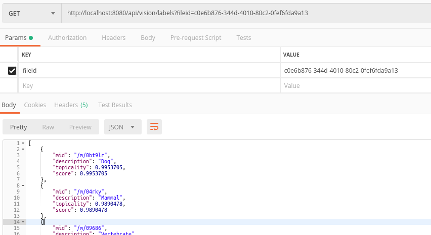

# petwise-backend

[](https://stepwise.pl/)

The project provides a REST API for the [Petwise Application](https://gitlab.com/stepwise/petwise/petwise-app). 

## Overview and technical features

### Integration with Google Cloud’s [Vision API](https://cloud.google.com/vision/)

* Labeling an image



* Identifying objects on an image (name, category and normalized vertices):


* Identifying one eligible object on an image (name, category and normalized vertices):


* Calling for crop hints (only confidence levels - experimental)


* Uploading a file to the `petwise-resources` bucket


* Getting a file from the `petwise-resources` bucket


* Creating a new pet entry in the database


* Creating a new missing report for a given pet


## Getting Started

To clone this repository, execute the following in the command line:
```bash
$ https://gitlab.com/stepwise/petwise/petwise-backend.git
```

### Database

1. To start the postgres database specified in the `application.properties` file, run the following command in the project main directory: `$ docker-compose up`.
2. To apply migrations run the `$ mvn clean flyway:migrate` command.

You should see the docker container up and running:
```bash
$ docker ps
CONTAINER ID        IMAGE               COMMAND                  CREATED             STATUS              PORTS                    NAMES
0883f8a30f2a        mdillon/postgis     "docker-entrypoint.s…"   11 minutes ago      Up 11 minutes       0.0.0.0:5432->5432/tcp   petwise-backend_petwise_db_1
```

and the database should be created like in the image below:


If you want to recreate the database from scratch (only if you want to reset the db created with the already existing migrations):
1. Adjust the first migration according to your needs (remove others).
2. Remove the database container with the `$ docker rm petwise-backend_petwise_db_1 -f` command.
3. Start the container with the `$ docker-compose up` command.
4. Run your migration with the `$ mvn clean flyway:migrate` command.

### Maven wrapper support
To ensure fully encapsulated build setup provided within the project, Spring Boot provides maven wrapper.

You can build the application:
* on Ubuntu with the following command:
```bash
$ ./mvnw clean install
```
* on Windows with the following command:
```bash
$ mvnw.cmd clean install
```

Optional: If you are working on IntelliJ IDEA, you may add [Maven wrapper support](https://plugins.jetbrains.com/plugin/10633-maven-wrapper-support/versions) plugin to the IDE.

### Google API key

To run this project locally, ask for a **json file with the API key** and add its path as the following **environmental variable** in the project configuration:
```
GOOGLE_APPLICATION_CREDENTIALS="your-path-to-the-file.json"
```


[Google authentication documentation](https://cloud.google.com/docs/authentication/getting-started)

## Running tests

> Configure tests to use the `GOOGLE_APPLICATION_CREDENTIALS` variable when running integration tests.

Run all backend tests with the following command in the root directory:
```bash
$ ./mvnw test
```

You can also start the application and manually test the API in Postman, upload your file to the bucket:


and use the `UUID` (here: `5ed7f476-c523-4c2f-a748-fb966765f34f`) in the response to call for labels, objects or crop hints.

### List of urls that will work
#### Labels
* `http://localhost:8080/api/vision/labels?fileid=5ed7f476-c523-4c2f-a748-fb966765f34f`
#### Localized objects
* `http://localhost:8080/api/vision/objects?fileid=5ed7f476-c523-4c2f-a748-fb966765f34f`
#### Eligible localized objects
* `http://localhost:8080/api/vision/eligible-object?fileid=5ed7f476-c523-4c2f-a748-fb966765f34f`
#### Crop hints
* `http://localhost:8080/api/vision/crop?fileid=5ed7f476-c523-4c2f-a748-fb966765f34f`
### File upload
* `http://localhost:8080/api/file/`

Method: `POST`

Body: `form data`

Key: `file`

Value: `your-image.png`

### File download
* `http://localhost:8080/api/file/5ed7f476-c523-4c2f-a748-fb966765f34f`

Method: `GET`

### Adding a new pet
* `http://localhost:8080/api/pet`

Method: `POST`

Body: `form data`

Key: `file`

Value: `your-image.png`

Key: `name`

Value: `Mr Cuddles`

### Adding "missing report"
* `http://localhost:8080/api/missing`

Method: `POST`
Body:
```
{ 
   "petId":1,
   "placeOfMissing":{ 
      "type":"Point",
      "coordinates":[ 
         1.2345678,
         2.3456789
      ]
   }
}
```

### Adding "spotted report"
* `http://localhost:8080/api/missing`

Method: `POST`

Body: `form data`

Key: `file`

Value: `your-image.png`

Key: `coordinate1`

Value: `1.001`

Key: `coordinate2`

Value: `2.002`

### Getting a pet by id
* `http://localhost:8080/api/pet/1`

Method: `GET`

### Getting list of "spotted reports"
* `http://localhost:8080/api/spotted/within-radius`

Method: `GET`

Body:
```
{
	"location": {
	    "type": "Point",
	    "coordinates": [
	        1.2345678,
	        2.3456789
	    ]
	}
}
```


### Getting list of "missing reports"
* `http://localhost:8080/api/missing/within-radius`

Method: `GET`

Body:
```
{
	"location": {
	    "type": "Point",
	    "coordinates": [
	        1.2345678,
	        2.3456789
	    ]
	}
}
```

## API documentation

* To see the API docs generated by Swagger build and run the application, and visit the ```http://localhost:8080/swagger-ui.html``` link in your browser:

* You can also generate the json documentation calling the `http://localhost:8080/v2/api-docs` endpoint:

## Built With

* [Spring Boot 2.2.1.RELEASE](https://start.spring.io/)
* [Java 11 - OpenJDK](https://openjdk.java.net/projects/jdk/11/) - [How to install](https://openjdk.java.net/install/)
* [Apache Maven 3.6.2](https://maven.apache.org/docs/3.6.2/release-notes.html)
* [Docker](https://spring.io/guides/gs/spring-boot-docker/) - [feature documentation](https://spring.io/guides/gs/spring-boot-docker/)
* [JUnit 5](https://junit.org/junit5/docs/current/user-guide/#overview)
* [PostGIS](https://postgis.net/), image: [mdillon/postgis](https://hub.docker.com/r/mdillon/postgis/dockerfile)
* [Spring Cloud GCP](https://spring.io/projects/spring-cloud-gcp)
* [Jackson-datatype-jts](https://github.com/graphhopper/jackson-datatype-jts/) - Jackson Module which provides custom serializers and deserializers for JTS Geometry objects using the GeoJSON format.

## Troubleshooting

### I can't build or start this application
* Make sure that the `GOOGLE_APPLICATION_CREDENTIALS` environmental variable is set for the project. The variable should contain the path to the json file with Google API credentials.
* You can build the application without running tests with the `mvn clean install -DskipTests` command.
* Make sure you have Open JDK 11 on your machine.
### I can't run integration tests
Make sure that the `GOOGLE_APPLICATION_CREDENTIALS` environmental variable is set for the tests. At the moment you have to set this variable manually. The variable should contain the path to the json file with Google API credentials.
### I get a database connection error
Run the `docker-compose up` command in the project main folder. To verify that the database is up, run the `docker conainer ls` command - you should see `petwise_db` service running.
### I can't rebuild the app image
Remove the `postgres` directory from the `data` directory placed in the project main folder.

## To do
* Stabilize docker environment
* Add feature that enables users to remove their data (delete user account). If legally possible, leave anonymised entries for missing reports, and resolved cases (for statistics).
* Fix hibernate sequence.
* Decide about custom point and custom geometry serialization to avoid using not official dependency.

## Possible limitations
Google Vision API seems not to provide similarity recognition. Objects on images can be labelled but there is no way of finding similarity between them in the API response.
To consider:
* [Amazon Rekognition Image](https://aws.amazon.com/rekognition/image-features/?nc=sn&loc=3&dn=2)
* [Comparison of Image Recognition APIs on food images](https://bytes.grubhub.com/https-medium-com-rohan-kulkarni-comparison-of-image-recognition-apis-on-food-images-cddc9105fc33)

Other applications for determining pet breeds:
* [Dog Scanner](https://play.google.com/store/apps/details?id=com.siwalusoftware.dogscanner&hl=pl)