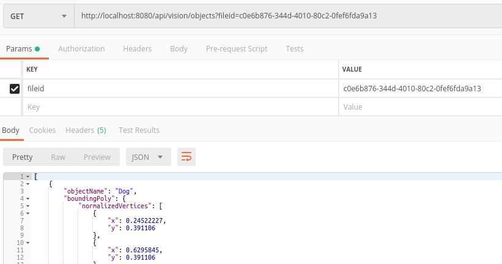

# petwise-backend

[](https://stepwise.pl/)

The project provides a REST API for the [Petwise Application](https://gitlab.com/stepwise/petwise/petwise-app). 

## Overview and technical features

### Integration with Google Cloud’s [Vision API](https://cloud.google.com/vision/)
* Labeling an image

* Identifying objects on an image (only names mapped):

* Calling for crop hints (only confidence levels - experimental)


## Getting Started

To clone this repository, execute the following in the command line:
```bash
$ https://gitlab.com/stepwise/petwise/petwise-backend.git
```

### Database
> Connection to database is not required now.

To set up the postgres database specified in the `application.properties` file run the following command in the project main directory:
```bash
$ docker-compose up
```

Until issue [PET-6](https://stepwisepl.atlassian.net/browse/PET-6) is fixed, please remove `postgres` directory (`data/postgres`) if you want to recreate the image.

### Maven wrapper support
To ensure fully encapsulated build setup provided within the project, Spring Boot provides maven wrapper.

You can build the application:
* on Ubuntu with the following command:
```bash
$ ./mvnw clean install
```
* on Windows with the following command:
```bash
$ mvnw.cmd clean install
```

Optional: If you are working on IntelliJ IDEA, you may add [Maven wrapper support](https://plugins.jetbrains.com/plugin/10633-maven-wrapper-support/versions) plugin to the IDE.

### Google API key

To run this project locally, ask for a **json file with the API key** and add its path the following **environmental variable** in project configuration:
```
GOOGLE_APPLICATION_CREDENTIALS="your-path-to-the-file.json"
```


[Google authentication documentation](https://cloud.google.com/docs/authentication/getting-started)

## Running tests

> Configure tests to use the `GOOGLE_APPLICATION_CREDENTIALS` variable when running integration tests.

Run all backend tests with the following command in the root directory:
```bash
$ ./mvnw test
```

You can also start the application and manually test the API in Postman - using photos that are already provided for you in the `resources` directory:


### List of urls that will work
####Labels
* `http://localhost:8080/api/test/labels?filepath=test-pictures/dog1.jpg`
* `http://localhost:8080/api/test/labels?filepath=test-pictures/dog2.jpg`
* `http://localhost:8080/api/test/labels?filepath=test-pictures/dog2-cropped.jpg`
* `http://localhost:8080/api/test/labels?filepath=test-pictures/dog2-cropped-properly.png`
* `http://localhost:8080/api/test/labels?filepath=test-pictures/dog3.jpg`
####Localized objects
* `http://localhost:8080/api/test/objects?filepath=test-pictures/dog1.jpg`
* `http://localhost:8080/api/test/objects?filepath=test-pictures/dog2.jpg`
* `http://localhost:8080/api/test/objects?filepath=test-pictures/dog2-cropped.jpg`
* `http://localhost:8080/api/test/objects?filepath=test-pictures/dog2-cropped-properly.png`
* `http://localhost:8080/api/test/objects?filepath=test-pictures/dog3.jpg`
####Crop hints
* `http://localhost:8080/api/test/crop?filepath=test-pictures/dog1.jpg`
* `http://localhost:8080/api/test/crop?filepath=test-pictures/dog2.jpg`
* `http://localhost:8080/api/test/crop?filepath=test-pictures/dog2-cropped.jpg`
* `http://localhost:8080/api/test/crop?filepath=test-pictures/dog2-cropped-properly.png`
* `http://localhost:8080/api/test/crop?filepath=test-pictures/dog3.jpg`

## API documentation

* To see the API docs generated by Swagger build and run the application, and visit the ```http://localhost:8080/swagger-ui.html``` link in your browser.

* You can also generate the json documentation calling the `http://localhost:8080/v2/api-docs` endpoint:

## Built With

* [Spring Boot 2.2.1.RELEASE](https://start.spring.io/)
* [Java 11 - OpenJDK](https://openjdk.java.net/projects/jdk/11/) - [How to install](https://openjdk.java.net/install/)
* [Apache Maven 3.6.2](https://maven.apache.org/docs/3.6.2/release-notes.html)
* [Docker](https://spring.io/guides/gs/spring-boot-docker/) - [feature documentation](https://spring.io/guides/gs/spring-boot-docker/)
* [JUnit 5](https://junit.org/junit5/docs/current/user-guide/#overview)
* [PostgreSQL](https://www.postgresql.org/)

## Troubleshooting

### I can't build or start this application
* Make sure that the `GOOGLE_APPLICATION_CREDENTIALS` environmental variable is set for the project. The variable should contain the path to the json file with Google API credentials.
* You can build the application without running tests with the `mvn clean install -DskipTests` command.
* Make sure you have Open JDK 11 on your machine.
### I can't run integration tests
Make sure that the `GOOGLE_APPLICATION_CREDENTIALS` environmental variable is set for the tests. At the moment you have to set this variable manually. The variable should contain the path to the json file with Google API credentials.
### I get a database connection error
Run the `docker-compose up` command in the project main folder. To verify that the database is up, run the `docker conainer ls` command - you should see `petwise_db` service running.
### I can't rebuild the app image
Remove the `postgres` directory from the `data` directory placed in the project main folder.

## To do
* Stabilize docker environment
* File upload
* If image can be cropped (to limit labeling only to a pet), crop it and resend the request for labels